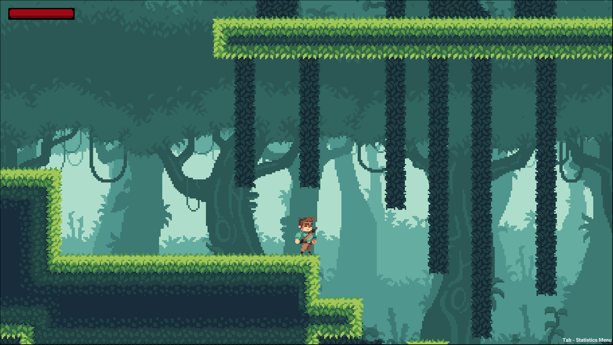
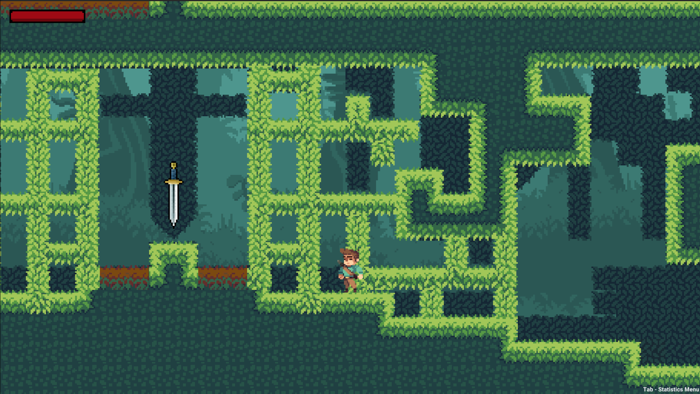
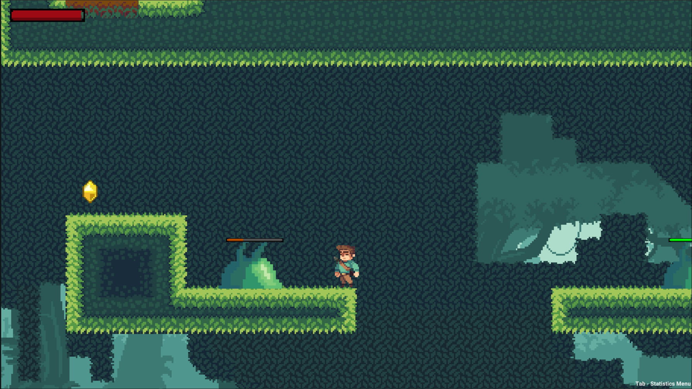
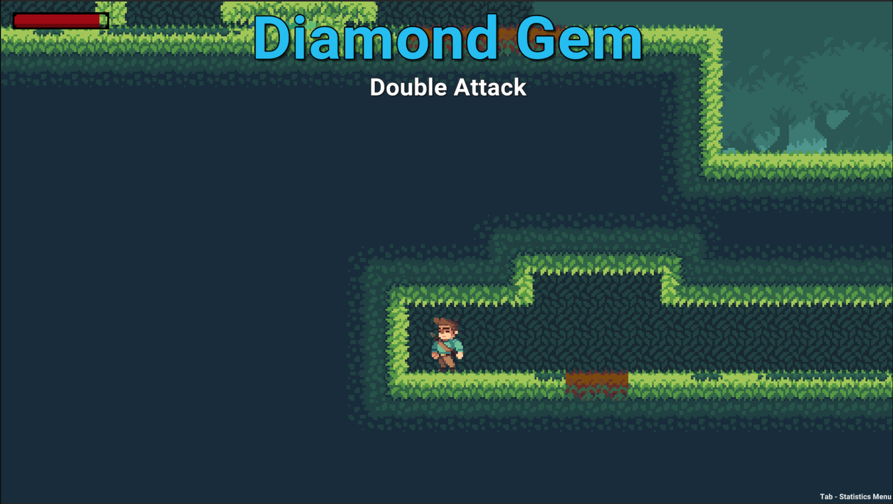

<h1><a href="https://koonraddev.itch.io/jungle-boy-adventure">Jungle Boy Adventure</a></h1>

<table>
<thead>

<tbody>
  <tr>
    <td></td>
    <td></td>
  </tr>
  <tr>
    <td></td>
    <td></td>
  </tr>
</tbody>
</table>

<h2>PLOT</h2>

You just need to get out of the jungle.

<h2>CONTROLS</h2>
<ul>
    <li>W - Jump</li>
    <li>A - Move Left</li>
    <li>D - Move Right</li>
    <li>LEFT ARROW - Shoot Left</li>
    <li>RIGHT ARROW - Shoot Right</li>
    <li>UP ARROW - Shoot Up</li>
    <li>DOWN ARROW - Shoot Down</li>
    <li>TAB - Statistics</li>
</ul>

<h2>ABOUT</h2>

A short 2D platform game where I took my first steps in gamedev. While creating the game, I learned how to use the Unity Editor, basic components and issues related to the operation of the Unity engine e.g. Order of execution for event functions.

